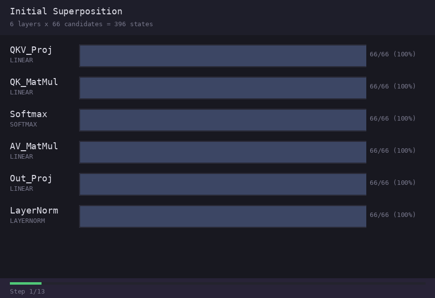
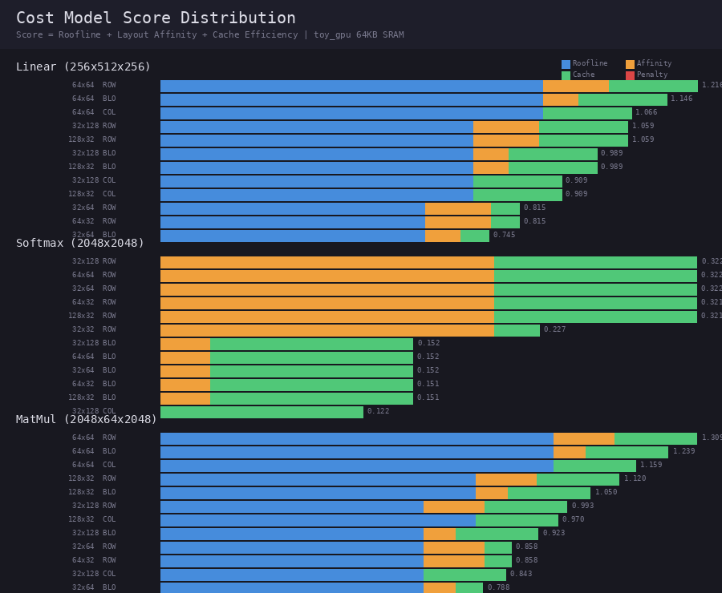
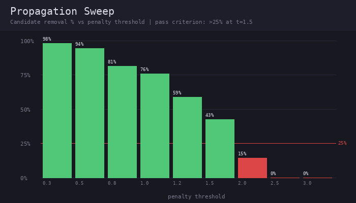
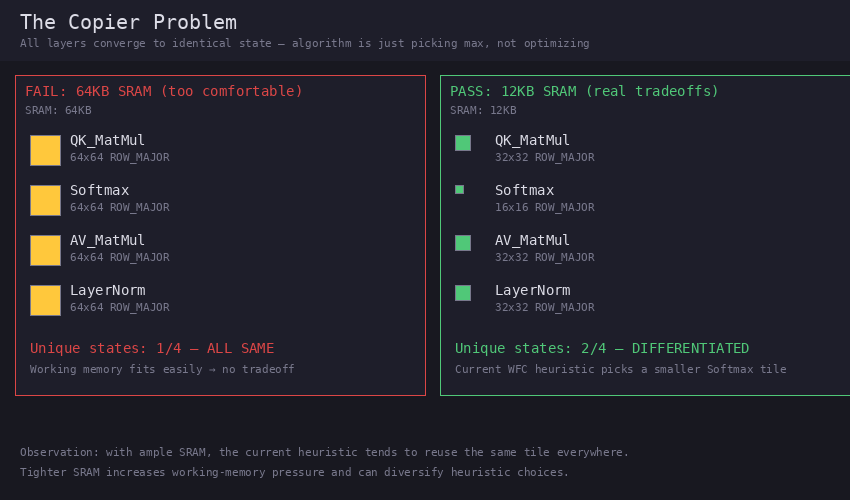
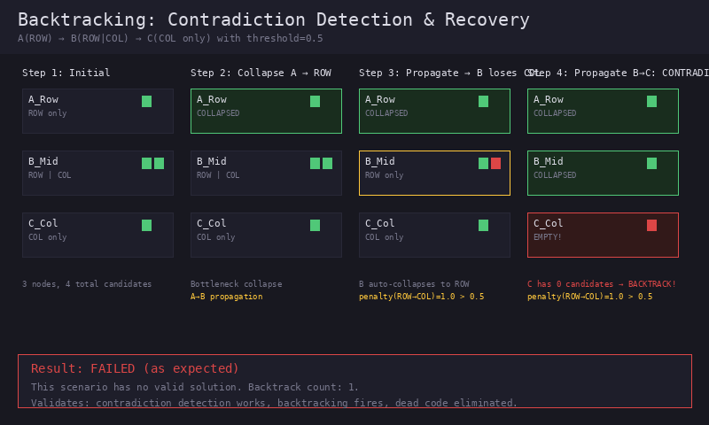
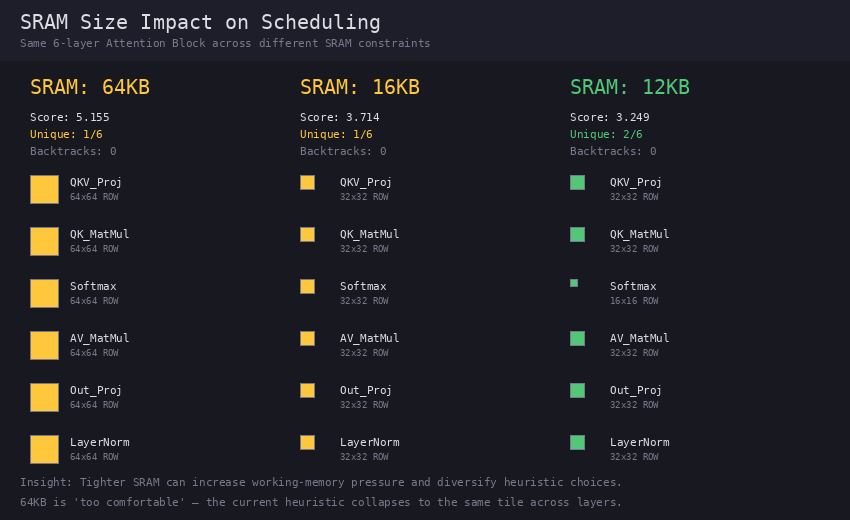

<p align="center">
  <a href="./README.md"></a>
  <a href="./README.ko.md"></a>
</p>
<p align="center"><sub>Switch language / 언어 전환</sub></p>

# HW-WFC

**Hardware Wave Function Collapse** — 제약 기반 붕괴적 탐색을 활용한 AI 하드웨어 컴파일러 자동 스케줄링

WFC(Wave Function Collapse) 알고리즘을 AI 하드웨어 컴파일러의 자동 스케줄링에 적용한 연구 프로토타입입니다. 각 레이어의 최적 타일 크기, 메모리 레이아웃, 연산 위치를 제약 기반 탐색으로 결정합니다.

> **처음 오신 분은** 알고리즘 컨셉과 동기를 설명하는 **[컨셉 문서](docs/concept.ko.md)**와 설계 의도 해설서인 **[아키텍처 가이드](docs/architecture_guide.ko.md)**를 먼저 읽어보세요.

## 동작 방식



1. **Superposition** — 각 레이어가 모든 가능한 HW 구현 상태(tile size × layout × location)를 후보로 시작
2. **Hard Constraints** — 물리적으로 불가능한 후보 제거 (SRAM 용량, alignment 위반)
3. **Bottleneck-First Collapse** — FLOPs가 가장 큰 레이어부터 최적 상태로 붕괴
4. **Constraint Propagation** — 붕괴된 노드에서 인접 노드로 전환 비용 기반 후보 제거
5. **Entropy-Ordered Collapse** — 남은 노드를 Shannon 엔트로피 순서로 붕괴
6. **Backtracking** — 모순 발생 시 snapshot 기반 상태 복원

## 핵심 결과

| 지표 | 값 |
|------|-----|
| 탐색 공간 축소 | 396 → 6 states (98.5%) |
| Truncated exhaustive 대비 일치도 | 100% (전환 비용 포함, 레이어당 top-8) |
| Full exact DP 대비 품질 | `stress_gpu` 98.3%, `toy_gpu` 100% |
| WFC 스케줄링 시간 | ~3ms (6-layer attention block, `stress_gpu`) |
| Naive truncated exhaustive | 262K 조합, ~7-9초 |
| Naive truncated exhaustive 대비 속도 향상 | **~2400배** |

이 수치는 `python examples/attention_exhaustive_benchmark.py`로 재현됩니다.
중요: `~2400배`는 이 체인 문제에 대한 최선의 exact solver 대비 수치가 아니라, naive top-k exhaustive 열거기 대비 수치입니다.
여기서 truncated exhaustive baseline은 hard constraint 이후 각 레이어의 상위 8개 unary 후보만 전수 탐색한 값(`8^6 = 262,144`)이므로, pairwise transition cost까지 고려한 진짜 최적해를 놓칠 수 있습니다.
같은 스크립트는 hard constraint 이후 전체 후보 집합에 대한 full exact dynamic programming 결과도 같이 보여주며, 현재 greedy WFC heuristic은 `stress_gpu`에서 그 exact objective의 `98.3%`에 머무르고 full optimum과는 일치하지 않습니다.

### 현재 Heuristic 차별화 결과 (12KB SRAM)

```
QKV_Proj   → 32x32  ROW_MAJOR  SRAM
QK_MatMul  → 32x32  ROW_MAJOR  SRAM
Softmax    → 16x16  ROW_MAJOR  SRAM  ← 현재 WFC 실행에서만 다름
AV_MatMul  → 32x32  ROW_MAJOR  SRAM
Out_Proj   → 32x32  ROW_MAJOR  SRAM
LayerNorm  → 32x32  ROW_MAJOR  SRAM
```

`stress_gpu`에서 현재 greedy WFC 실행은 Softmax를 `16x16`으로 붕괴시키고, 나머지 레이어는 `32x32`를 유지합니다.
중요: working-memory 초과는 현재 [src/cost_model.py](/mnt/d/devel/hw-wfc/src/cost_model.py)에서 강한 cache penalty로만 모델링되고, [src/constraint.py](/mnt/d/devel/hw-wfc/src/constraint.py)에서 hard elimination으로 제거되지는 않습니다. 따라서 이 결과는 heuristic 붕괴 결과이지, `32x32` Softmax가 물리적으로 불가능하다는 뜻은 아닙니다.

## 시각화

모든 시각화는 `python tools/generate_all_visuals.py`로 재생성됩니다.
코드 변경 후 시각화를 업데이트하면 이전과의 차이를 시각적으로 확인할 수 있습니다.
기록은 [assets/VISUALS_LOG.md](assets/VISUALS_LOG.md)에 자동 추가됩니다.

### Cost Model 점수 분포

레이어 타입별 후보 점수를 Roofline(파랑) + Affinity(주황) + Cache(초록)로 분해. 빨간색은 cache 패널티.



### 제약 전파 Sweep

threshold를 0.3 ~ 3.0까지 변화시켰을 때 후보 제거율. 빨간 선(25%)이 통과 기준. 현재 t=1.5에서 43%.



### 복사기 문제 (실패 → 해결)

SRAM이 넉넉하면(64KB) 모든 레이어가 같은 상태로 수렴하는 "복사기 문제" 발생.
SRAM을 줄이면(12KB) 현재 WFC heuristic이 Softmax에 다른 타일을 선택하는 경향이 나타납니다.



### 백트래킹: 모순 & 복구

의도적으로 해결 불가능한 제약 조합을 구성하여 백트래킹이 실제 발동하는지 검증.
ROW → ? → COL 체인에서 threshold=0.5일 때 모순 발생 → 백트래킹 1회 발동 → 실패 확인.



### SRAM 크기별 영향

동일한 6-layer Attention Block을 64KB / 16KB / 12KB SRAM에서 실행.
현재 heuristic 실행에서는 12KB에서만 Softmax가 작은 타일(16x16)을 선택하여 차별화가 나타납니다.



## 아키텍처

```
┌─────────────┐     ┌───────────────┐     ┌──────────────┐
│  LayerNode  │────▶│ HardConstraint│────▶│  CostModel   │
│ (candidates)│     │  (SRAM, align)│     │ (roofline +  │
│             │     │               │     │  affinity +  │
│ HWState[]   │     └───────────────┘     │  cache)      │
└─────────────┘                           └──────┬───────┘
                                                 │
       ┌──────────────────────────────────────────┘
       ▼
┌──────────────┐     ┌───────────────┐     ┌──────────────┐
│CollapseEngine│────▶│  Propagation  │────▶│  Scheduler   │
│ (entropy,    │     │ (layout +     │     │ (bottleneck  │
│  backtrack)  │     │  tile_shape + │     │  first,      │
│              │     │  location)    │     │  bidirect)   │
└──────────────┘     └───────────────┘     └──────────────┘
```

## GPU 실행 검증 (v2.7)

`.venv` 환경에서 RTX 3060 (SM86, CUDA 12.8)로 codegen 생성 Triton 커널을 다시 검증:

| 커널 | 타입 | 결과 | 오차 |
|------|------|------|------|
| Linear (MatMul) | GEMM | 통과 | rel_err < 0.5% (fp16) |
| ReLU | Element-wise | 통과 | 정확 일치 |
| Softmax | Row-parallel | 통과 | max_diff < 1e-8 |

### HW-WFC vs Triton Autotuner

이 섹션은 현재 재감사 중입니다.

같은 `.venv`, 같은 RTX 3060에서 반복 재실행했을 때 평균 비율이 이미 `118%`와 `84%`로 크게 달랐습니다.
그 뒤 공유 Triton 캐시를 끊기 위해 매번 별도 프로세스와 별도 `TRITON_CACHE_DIR`로 5회를 더 돌렸고, 다른 GPU compute 프로세스도 보이지 않는 상태였지만 평균 비율은 여전히 `86.0% ~ 94.6%` 범위로 흔들렸습니다. 따라서 기존의 고정 TFLOPS 표를 README의 확정 수치로 유지하기에는 아직 불안정합니다.

현재까지 확인된 사실:
- Triton 커널은 실제 GPU에서 correctness를 통과한다.
- 비교 스크립트는 `.venv`에서 end-to-end로 실행된다.
- 격리 재실행에서도 패턴은 보인다. 아주 작은 `Small (256x512x256)`는 실행 시간이 ~`0.01-0.02ms`라 `32x64x32`와 `32x32x32` 사이에서 autotuner 선택이 흔들리고, 더 큰 워크로드에서는 autotuner가 더 일관되게 `64x64x32` 또는 `128x128x32`를 골라 현재 WFC 선택보다 대체로 `5-20%` 빠르다.
- WFC/autotuner 성능 비율은 현재 benchmark 방법론을 더 안정화한 뒤에 다시 문서화해야 한다.

## 빠른 시작

```bash
# Transformer Attention Block 스케줄링
python examples/attention_block.py

# README benchmark 재현 (top-8 exhaustive baseline)
python examples/attention_exhaustive_benchmark.py

# Safety Checks 실행
python tests/test_safety_checks.py

# GPU에서 Triton 커널 검증 (torch + triton 필요)
python examples/triton_verify.py

# WFC vs Triton autotuner 비교
python examples/triton_autotuner_compare.py

# 전체 시각화 생성/업데이트
python tools/generate_all_visuals.py
```

## 비용 모델

3요소 합산:

- **Roofline Score** — 타일링에 의한 데이터 재사용률 반영. MatMul은 타일이 클수록, Softmax는 tile_n이 클수록 유리
- **Layout Affinity** — 레이어 타입별 선호 레이아웃 (LINEAR→ROW_MAJOR, SOFTMAX→ROW_MAJOR, CONV2D→BLOCK_TILED)
- **Cache Efficiency** — SRAM 활용률 가우시안 함수 (75%에서 피크, working memory multiplier 적용)

## 하드웨어 스펙

| 스펙 | SRAM | 용도 |
|------|------|------|
| `toy_gpu.json` | 64KB | 편안한 환경, 기본 검증용 |
| `tight_gpu.json` | 16KB | 중간 제약 |
| `stress_gpu.json` | 12KB | tight SRAM, 레이어별 차별화 발생 |
| `a100.json` | 192KB | NVIDIA A100 (HBM2e 2039 GB/s) |
| `h100.json` | 256KB | NVIDIA H100 (HBM3 3352 GB/s) |
| `rtx3060.json` | 100KB | NVIDIA RTX 3060 (GDDR6 360 GB/s) — GPU 실행 검증 완료 |

## Safety Checks (5/5 통과)

| # | 검증 항목 | 상태 | 기준 |
|---|----------|------|------|
| 1 | Hard Constraint 정확성 | 통과 | false positive/negative 없음 |
| 2 | Cost Model 변별력 | 통과 | 점수 spread > 0.01 (실제: 1.19) |
| 3 | 전파 실효성 | 통과 | t=1.5에서 제거율 > 25% (실제: 43%) |
| 4 | 백트래킹 활성화 | 통과 | 모순 시 발동 (검증됨) |
| 5 | 복사기 문제 없음 | 통과 | 이질적 레이어가 다른 상태 선택 |

## 프로젝트 구조

```
hw-wfc/
├── src/                    # 코어 알고리즘
│   ├── state.py            # HWState, LayerNode, superposition
│   ├── constraint.py       # Hard/Soft 제약, 전파, 자동 가중치
│   ├── cost_model.py       # Roofline + affinity + cache
│   ├── collapse.py         # 엔트로피 기반 붕괴 + 백트래킹
│   └── scheduler.py        # 메인 파이프라인
├── specs/                  # 하드웨어 스펙 (JSON)
├── examples/               # PoC 스크립트
├── tests/                  # Safety Checks
├── tools/                  # 시각화 생성기
├── assets/                 # 생성된 이미지/GIF
├── docs/
│   ├── concept.md / .ko.md             # 알고리즘 컨셉 & 동기 (EN/KO)
│   ├── architecture_guide.md / .ko.md  # 설계 의도 해설서 (EN/KO)
│   └── daily_logs/                     # 작업 일지
└── HANDOFF.md              # 다음 작업 & 아이디어
```

## 요구사항

- Python 3.10+
- Pillow (시각화 전용)
- PyTorch + Triton (GPU 검증 전용, `pip install torch triton`)

## 라이선스

연구용 프로토타입. 프로덕션 사용 불가.
